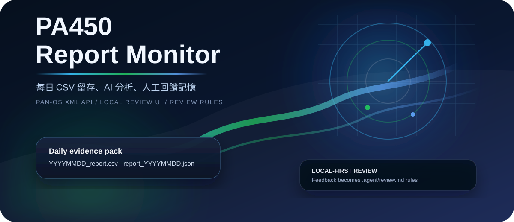
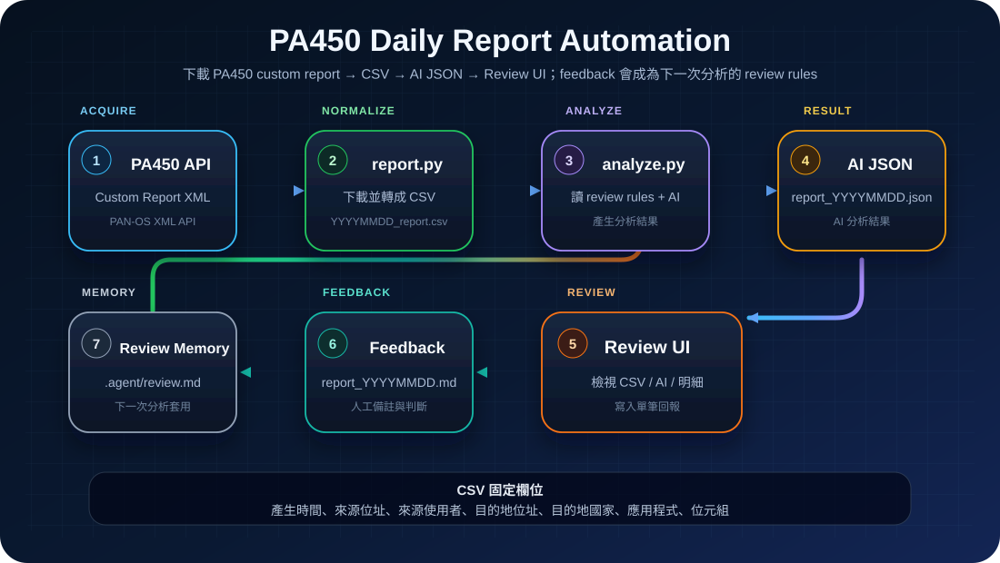

# 🛡️ PA450 Report CSV Monitor

<p align="center">
  
</p>

<p align="center">
  <strong>Windows 本機執行的 PA450 custom report 下載、CSV 轉檔、AI 分析與 Review UI 工具</strong>
</p>

<p align="center">
  
  
  
  
</p>

PA450 Report CSV Monitor 會透過 **PAN-OS XML API** 下載指定的 PA450 custom report，轉成每日 CSV，交給 AI Gateway 分析，並提供本機 Review UI 讓使用者檢視 CSV / AI JSON 與針對單筆資料寫入 feedback。下一次分析前，程式會讀取尚未處理過的 feedback，萃取成可重用 review rules，讓 AI 分析逐步貼近實際環境。

---

## 文件入口

- 主程式：`src\report.py`
- AI 分析：`src\analyze.py`
- Review UI：`src\ui.py`
- Review memory：`.agent\review.md`
- Feedback 檔案：`output\report_YYYYMMDD.md`
- UI exe 打包：`scripts\build-ui-exe.ps1`

## 快速入口

```powershell
python -m venv .venv
.venv\Scripts\Activate
pip install -r requirements.txt
Copy-Item .env.example .env
Copy-Item config.example.yaml config.yaml
python src\report.py --config config.yaml --output-dir output
python src\analyze.py --input output\YYYYMMDD_report.csv --output output\report_YYYYMMDD.json
```

---

## 概觀

<p align="center">
  
</p>

```text
PA450 custom report
→ src\report.py 下載 PAN-OS XML API 結果並轉成 CSV
→ output\YYYYMMDD_report.csv
→ src\analyze.py 先處理 feedback / review memory
→ 讀取 .agent\review.md 作為 review rules
→ AI 分析 CSV
→ output\report_YYYYMMDD.json
→ Review UI 檢視 CSV / AI JSON 並寫入 output\report_YYYYMMDD.md
→ 下一次分析前把 feedback 萃取成新的 review rules
```

## 功能特色

- **PA450 custom report 下載**：透過 PAN-OS XML API 取得指定 custom report。
- **每日 CSV 輸出**：輸出 `output\YYYYMMDD_report.csv`，欄位固定且可直接給 AI 分析。
- **AI Gateway 分析**：將 CSV context 送給指定 AI model，輸出 `output\report_YYYYMMDD.json`。
- **Review UI**：本機 UI 可檢視每日 CSV、AI 分析結果，並針對單筆資料寫入 feedback。
- **Review memory**：分析前自動讀取尚未處理的 `report_YYYYMMDD.md`，萃取成 `.agent\review.md` 長期規則。

---

## 專案結構

```text
pa450-report-monitor/
├── AGENTS.md                    # runtime 預先載入的分析規則
├── .agent/
│   ├── review.md                # 長期 review rules
│   └── review_state.json        # feedback 處理 checkpoint
├── assets/
│   └── images/                  # README 圖片
├── output/                      # 每日 CSV / AI JSON / feedback markdown
├── scripts/
│   └── build-ui-exe.ps1         # Review UI exe 打包腳本
├── src/
│   ├── report.py                # PA450 report 下載、XML 轉 CSV
│   ├── analyze.py               # AI 分析 CSV，並在分析前處理 feedback / review memory
│   ├── ui.py                    # localhost-only Review UI 入口
│   ├── config.py                # .env / config.yaml 設定載入與 CSV 欄位定義
│   ├── ui_app/
│   │   ├── data.py              # UI 資料讀取、報告探索、feedback 寫入
│   │   └── assets/index.html    # UI HTML/CSS/JavaScript template
│   └── runtime/
│       ├── prompt_builder.py    # AGENTS.md / review rules prompt 組裝
│       └── review_tools.py      # review.md / review_state.json / feedback 掃描
├── .env.example                 # .env 範本
├── config.example.yaml          # PA450 report 設定範本
├── requirements.txt             # Python 套件
└── README.md
```

---

## 系統需求

- Windows 10/11
- Python 3.10+

---

## 安裝

### 1. 建立 Python venv

在專案根目錄開啟 PowerShell：

```powershell
python -m venv .venv
.venv\Scripts\Activate
```

### 2. 安裝套件

```powershell
python -m pip install --upgrade pip
pip install -r requirements.txt
```

### 3. 建立本機設定檔

```powershell
Copy-Item .env.example .env
Copy-Item config.example.yaml config.yaml
```

### 4. 確認指令可使用

```powershell
python src\report.py --help
python src\analyze.py --help
python src\ui.py --help
```

---

## 設定 `.env`

`.env` 欄位：

| 欄位 | 用途 |
|---|---|
| `PA450_HOST` | PA450 management IP 或 hostname |
| `PA450_USERNAME` | PA450 使用者名稱 |
| `PA450_PASSWORD` | PA450 密碼 |
| `PA450_API_KEY` | PA450 API key |
| `AI_GATEWAY_URL` | AI Gateway base URL |
| `AI_GATEWAY_API_KEY` | AI Gateway API key |
| `AI_MODEL` | AI model 名稱 |
| `AI_TEMPERATURE` | AI temperature |

`PA450_API_KEY` 與 `PA450_USERNAME` / `PA450_PASSWORD` 二選一即可：

- 有 `PA450_API_KEY`：程式直接使用 API key。
- 沒有 `PA450_API_KEY`：程式會使用 `PA450_USERNAME` / `PA450_PASSWORD` 取得 API key。

---

## 設定 `config.yaml`

主要設定項目：

| 欄位 | 用途 |
|---|---|
| `pa450.verify_tls` | 是否驗證 PA450 TLS 憑證 |
| `pa450.report_name` | PA450 custom report 名稱，例如 `YOUR_CUSTOM_REPORT_NAME` |
| `pa450.report_job_name` | PA450 dynamic report job 名稱 |

---

## PA450 custom report 欄位

PA450 custom report 建議至少包含下列欄位，程式會轉成固定中文 CSV 欄位：

| CSV 欄位 | 來源欄位用途 |
|---|---|
| `產生時間` | generated time |
| `來源位址` | Source address |
| `來源主機名稱` | Source hostname |
| `來源使用者` | Source user |
| `目的地位址` | Destination address |
| `目的地國家` | Destination Country |
| `目的地主機名稱` | Destination hostname |
| `應用程式` | Application |
| `位元組` | Bytes |

---

## 執行 PA450 report 下載

```powershell
.venv\Scripts\Activate
python src\report.py --config config.yaml --output-dir output
```

參數：

| 參數 | 用途 |
|---|---|
| `--config` | 指定設定檔 |
| `--output-dir` | 指定 CSV 輸出資料夾 |

CSV 輸出檔名：

```text
YYYYMMDD_report.csv
```

---

## 執行 AI 分析

```powershell
.venv\Scripts\Activate
python src\analyze.py --input output\YYYYMMDD_report.csv --output output\report_YYYYMMDD.json
```

分析開始前，`src\analyze.py` 會先執行 review memory 流程：

1. 讀取 `.agent\review.md` 內既有的 review rules。
2. 掃描 `output\report_YYYYMMDD.md`。
3. 只處理日期晚於 `.agent\review_state.json` 內 `last_processed_feedback_date` 的 feedback 檔。
4. 一次讀取多日 feedback，交給 AI 萃取簡短、可重用規則。
5. 將新規則寫回 `.agent\review.md`。
6. 更新 `.agent\review_state.json`，記錄已處理到哪一天。
7. 使用更新後的 review rules 執行本次 CSV 分析。

參數：

| 參數 | 用途 |
|---|---|
| `--input` | 要餵給 AI 的 CSV 檔案 |
| `--output` | AI 分析結果 JSON 輸出位置，例如 `output\report_YYYYMMDD.json` |
| `--query` | 可選，覆蓋預設分析問題 |

JSON 輸出格式：

```json
{
  "analysis": "AI 回答內容"
}
```

---

## Review UI exe

在專案根目錄開啟 PowerShell，執行：

```powershell
.venv\Scripts\Activate
powershell -ExecutionPolicy Bypass -File scripts\build-ui-exe.ps1
```

打包完成後，exe 會輸出到：

```text
dist\PA450-Daily-Review-UI.exe
```

Review UI 會讀取：

```text
YYYYMMDD_report.csv
report_YYYYMMDD.json
report_YYYYMMDD.md
```

UI 可用來檢視每日 CSV、AI 分析結果，並針對單筆資料寫入回報。

### Review UI 使用方式

1. 執行 `dist\PA450-Daily-Review-UI.exe`。
2. 在左側選擇資料夾：
   - `CSV load folder`：放 `YYYYMMDD_report.csv` 的資料夾。
   - `AI JSON load folder`：放 `report_YYYYMMDD.json` 的資料夾。
   - `回報 load folder`：讀寫 `report_YYYYMMDD.md` 的資料夾。
3. 按 `讀取資料夾`，UI 會列出可配對的每日報告。
4. 點選左側日期切換報告。
5. 在 `CSV 完整檢視` 搜尋、依來源 IP 或應用程式篩選資料列。
6. 點選單筆 CSV 資料列後，右側會顯示列明細。
7. 在 `報告回報` 填寫備註並按 `儲存`，回報會寫入對應日期的 `report_YYYYMMDD.md`。

---

## Feedback 與 review memory

人工 feedback 檔名格式固定為：

```text
report_YYYYMMDD.md
```

`YYYYMMDD` 是 report 下載日期。`src\analyze.py` 不負責產生 feedback markdown，只在下一次分析開始前讀取尚未處理過的檔案。

長期 review 規則儲存在：

```text
.agent\review.md
```

feedback 處理 checkpoint 儲存在：

```json
{
  "last_processed_feedback_date": "YYYYMMDD"
}
```

位置：

```text
.agent\review_state.json
```
---
